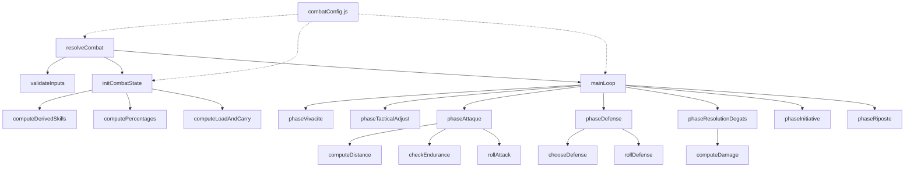

# Document de Conception — Refonte du Moteur de Combat

## Vue d'ensemble

Ce document décrit la conception technique de la refonte complète du moteur de combat du Dungeon Crawler. Le nouveau système remplace l'implémentation existante dans `server/game/combat.js` par une architecture modulaire, testable et configurable.

Le moteur de combat résout un affrontement entre deux combattants (joueur vs créature) à travers une boucle structurée en minutes (max 20) et tempos (20 par minute). Chaque tempo exécute une séquence de phases : Attaque → Défense → Résolution Dégâts → Initiative → Riposte. Les compétences sont dérivées de 7 statistiques primaires, normalisées en pourcentages, puis ajustées par les tactiques choisies minute par minute.

### Principes de conception

- **Fonctions pures** : Chaque calcul (compétences, dégâts, fatigue) est une fonction pure sans effet de bord
- **Configuration externalisée** : Toutes les constantes dans `combatConfig.js`
- **Phases isolées** : Chaque phase du combat est une fonction distincte avec interface entrée/sortie claire
- **Déterminisme contrôlé** : Le seul élément aléatoire est le D100, injectable pour les tests

## Architecture



### Structure des fichiers

```
server/game/
├── combat.js          # Point d'entrée — boucle principale et orchestration
├── combatConfig.js    # Configuration externalisée (constantes, tables, seuils)
└── __tests__/
    ├── combat.skills.property.test.js
    ├── combat.normalization.property.test.js
    ├── combat.tactics.property.test.js
    ├── combat.dice.property.test.js
    ├── combat.endurance.property.test.js
    ├── combat.fatigue.property.test.js
    ├── combat.distance.property.test.js
    ├── combat.defense.property.test.js
    ├── combat.initiative.property.test.js
    ├── combat.damage.property.test.js
    ├── combat.validation.property.test.js
    ├── combat.termination.property.test.js
    ├── combat.vivacity.property.test.js
    └── combat.integration.test.js
```

## Composants et Interfaces

### 1. Point d'entrée : `resolveCombat(playerData, creatureData, rng?)`

```javascript
/**
 * @param {CombatantInput} playerData - Données du joueur
 * @param {CombatantInput} creatureData - Données de la créature
 * @param {Function} [rng] - Générateur aléatoire injectable (défaut: Math.random)
 * @returns {CombatResult} Résultat complet du combat
 */
export function resolveCombat(playerData, creatureData, rng = Math.random)
```

### 2. Validation : `validateInputs(playerData, creatureData)`

Vérifie la conformité des données d'entrée :
- 7 statistiques primaires dans [1, 24]
- Au moins une tactique définie avec EO, NA, EN dans [1, 10]
- Équipement complet (arme avec distance optimale, armure)

Lève une `Error` descriptive si une contrainte est violée.

### 3. Initialisation : `initCombatState(playerData, creatureData, config)`

Construit l'état initial du combat :
- Calcul HPMAX, ENDMAX
- Calcul des 6 compétences dérivées
- Normalisation en pourcentages [12.5%, 87.5%]
- Calcul Charge, Portage, Surcoût

### 4. Calcul des compétences dérivées : `computeDerivedSkills(stats, config)`

```javascript
/**
 * @param {Stats} stats - {FOR, CON, TAI, INT, VOL, VIT, ADR}
 * @param {Config} config - Coefficients depuis combatConfig
 * @returns {DerivedSkills} {vivacite, initiative, attaque, parade, esquive, riposte}
 */
```

Formules :
| Compétence | Formule | Plage |
|---|---|---|
| Vivacité | TAI×6 + INT×12 + VIT×7 + ADR×8 | [33, 792] |
| Initiative | INT×4 + VOL×6 + VIT×9 | [19, 456] |
| Attaque | FOR×6 + INT×10 + VOL×6 + ADR×10 | [32, 768] |
| Parade | FOR×6 + VOL×6 + ADR×10 + (24-TAI)×6 | [22, 666] |
| Esquive | INT×10 + VOL×6 + VIT×5 + ADR×10 + (24-TAI)×6 | [52, 888] |
| Riposte | INT×6 + VIT×10 + ADR×10 | [26, 624] |

### 5. Normalisation : `normalizeToPercent(rawSkill, divisor, config)`

```javascript
/**
 * @param {number} rawSkill - Compétence brute
 * @param {number} divisor - Diviseur spécifique à la compétence
 * @returns {number} Pourcentage dans [12.5, 87.5], arrondi à 2 décimales
 */
```

Diviseurs par compétence :
| Compétence | Diviseur | Formule |
|---|---|---|
| Vivacité | 396 | skill × 50 / 396 |
| Initiative | 228 | skill × 50 / 228 |
| Attaque | 384 | skill × 50 / 384 |
| Esquive | 444 | skill × 50 / 444 |
| Parade | 336 | skill × 50 / 336 |
| Riposte | 312 | skill × 50 / 312 |

### 6. Ajustements tactiques : `computeEffectiveSkills(percentages, tactics, distance, weaponDist, config)`

```javascript
/**
 * @param {Percentages} percentages - Compétences en pourcentage
 * @param {Tactics} tactics - {EO, NA, EN} de la minute courante
 * @param {number} distance - Distance courante [1, 10]
 * @param {number} weaponDist - Distance optimale de l'arme [1, 10]
 * @returns {EffectiveSkills} Compétences effectives bornées dans [1, 99]
 */
```

### 7. Système de jets : `rollSkill(effectiveSkill, fatigue, rng)`

```javascript
/**
 * @param {number} effectiveSkill - Compétence effective [1, 99]
 * @param {number} fatigue - Malus de fatigue {0, 5, 10, 15, 20}
 * @param {Function} rng - Générateur aléatoire
 * @returns {{quality: number, d100: number, success: boolean}}
 */
```

Formule uniforme : `quality = effectiveSkill - d100 - fatigue`

### 8. Système d'endurance : `getFatigueTier(endurance, config)`

```javascript
/**
 * @param {number} endurance - Endurance courante
 * @returns {{fatigue: number, naCap: number}} Palier de fatigue et plafond NA
 */
```

Paliers :
| Endurance | Fatigue | Plafond NA |
|---|---|---|
| ≤ 10 | 20 | 2 |
| 11–20 | 15 | 4 |
| 21–30 | 10 | 6 |
| 31–40 | 5 | 8 |
| > 40 | 0 | ∞ |

### 9. Gestion de la distance : `computeMovement(currentDist, en, na, config)`

```javascript
/**
 * @param {number} currentDist - Distance actuelle [1, 10]
 * @param {number} en - Engagement tactique [1, 10]
 * @param {number} na - Niveau d'activité effectif
 * @returns {number} Nouvelle distance [1, 10]
 */
```

- Distance souhaitée = 11 - EN
- Déplacement max = floor(NA / 2)
- Résultat borné dans [1, 10]

### 10. Sélection de défense : `selectDefense(esquiveEff, paradeEff, endurance, coutEsquive, coutParade)`

```javascript
/**
 * @returns {{type: 'esquive'|'parade'|'encaissement', cost: number}}
 */
```

Logique :
1. Si Esquive_eff > Parade_eff → préférer esquive
2. Sinon → préférer parade
3. Si endurance insuffisante pour la préférée → dégrader vers l'autre
4. Si aucune payable → encaissement direct

### 11. Calcul des dégâts : `computeDamage(weapon, attackerStats, targetFamily, armorReduction, config)`

```javascript
/**
 * @returns {number} Dégâts finals ≥ 0
 */
```

Formule : `DégâtsFinals = max(0, floor(BaseArme × modMateriau × coef_STATS × modAffinité × modTypeDégâts) - Armure)`

### 12. Phases de combat (fonctions isolées)

Chaque phase reçoit et retourne un objet `CombatState` :

```javascript
function phaseVivacite(state, rng) → state
function phaseAttaque(state, rng) → state
function phaseDefense(state, rng) → state
function phaseResolutionDegats(state) → state
function phaseInitiative(state, rng) → state
function phaseRiposte(state, rng) → state
```

## Modèles de Données

### CombatantInput (entrée)

```javascript
{
  stats: { FOR: 1-24, CON: 1-24, TAI: 1-24, INT: 1-24, VOL: 1-24, VIT: 1-24, ADR: 1-24 },
  tactic: [{ EO: 1-10, NA: 1-10, EN: 1-10 }, ...],  // 1 par minute (dernière réutilisée)
  weaponDef: {
    poids: 1-14,
    dist: 1-10,
    degatsBase: number,
    materiau: 0-7,
    affinites: { [famille]: -100..100 },
    poidsStats: { FOR: number, ADR: number, VIT: number, TAI: number, INT: number }
  },
  equipment: {
    armure: { reduction: number ≥ 0, poids: number }
  }
}
```

### CombatState (état interne)

```javascript
{
  minute: number,           // 1..20
  tempo: number,            // 1..20
  distance: number,         // 1..10
  attacker: 'player' | 'creature',
  
  player: {
    hp: number,
    hpMax: number,
    endurance: number,
    endMax: number,
    fatigue: number,        // {0, 5, 10, 15, 20}
    naCap: number,          // plafond NA du palier
    skills: { vivacite, initiative, attaque, parade, esquive, riposte },  // brutes
    percentages: { ... },   // normalisées
    effective: { ... },     // ajustées par tactiques
    tactics: { EO, NA, EN },  // tactique de la minute courante
    charge: number,
    portage: number,
    surcout: number,
    weapon: { ... },
    armor: { reduction: number }
  },
  
  creature: { /* même structure */ },
  
  log: [{ type: string, text: string }],
  result: null | { winner: 'player'|'creature'|'draw', hpPlayer: number, hpCreature: number }
}
```

### CombatResult (sortie)

```javascript
{
  log: [{ type: string, text: string }],
  winner: 'player' | 'creature' | 'draw',
  hpPlayer: number,
  hpCreature: number
}
```

### CombatConfig (configuration)

```javascript
export const COMBAT = {
  // Boucle principale
  nbTempoParMinute: 20,
  maxMinutes: 20,
  distanceInitiale: 10,
  distanceMin: 1,
  distanceMax: 10,

  // Phases (séquence configurable)
  phases: ['attaque', 'defense', 'resolutionDegats', 'initiative', 'riposte'],

  // Compétences dérivées — coefficients
  skills: {
    vivacite:   { TAI: 6, INT: 12, VIT: 7, ADR: 8 },
    initiative: { INT: 4, VOL: 6, VIT: 9 },
    attaque:    { FOR: 6, INT: 10, VOL: 6, ADR: 10 },
    parade:     { FOR: 6, VOL: 6, ADR: 10, TAI_INV: 6 },  // (24-TAI)×6
    esquive:    { INT: 10, VOL: 6, VIT: 5, ADR: 10, TAI_INV: 6 },
    riposte:    { INT: 6, VIT: 10, ADR: 10 }
  },

  // Normalisation — diviseurs
  normalization: {
    vivacite: 396,
    initiative: 228,
    attaque: 384,
    esquive: 444,
    parade: 336,
    riposte: 312
  },
  percentMin: 12.5,
  percentMax: 87.5,
  effectiveMin: 1,
  effectiveMax: 99,

  // Ajustements tactiques — formules
  tacticalAdjustments: {
    vivacite:   { EO: 2, NA: 1 },           // (EO-5)×2 + (NA-5)×1
    initiative: { EO: 1, NA: 1, EN: 1 },    // (EO-5) + (NA-5) + (EN-5)
    attaque:    { EO: 1, distFactor: 2 },    // (EO-5) + (5-|dist|)×2
    esquive:    { EO: -1, NA: 1, EN: -1 },   // (5-EO) + (NA-5) + (5-EN)
    parade:     { EO: -1, NA: -1, EN: -1 },  // (5-EO) + (5-NA) + (5-EN)
    riposte:    { EO: -1, NA: -1, EN: 2 }    // (5-EO) + (5-NA) + (EN-5)×2
  },
  tacticNeutral: 5,

  // HP et Endurance
  hpFormula: { CON: 19, TAI: 5, VOL: 2 },
  hpMin: 78,
  hpMax: 546,
  endFormula: { multiplier: 3 },  // (FOR + CON + VOL) × 3
  endMin: 27,
  endMax: 189,

  // Fatigue — paliers
  fatigueTiers: [
    { threshold: 10, fatigue: 20, naCap: 2 },
    { threshold: 20, fatigue: 15, naCap: 4 },
    { threshold: 30, fatigue: 10, naCap: 6 },
    { threshold: 40, fatigue: 5,  naCap: 8 },
    { threshold: Infinity, fatigue: 0, naCap: Infinity }
  ],

  // Endurance — coûts
  gainRecuperation: 1,
  surcoutDiviseur: 26,
  surcoutMultiplier: 10,

  // Dégâts
  statBaseline: 12,
  statCoef: 0.02,
  materialsTable: [1.0, 1.25, 1.375, 1.5, 1.625, 1.75, 1.875, 2.0],
  modTypeDegats: 1.0
};
```


## Propriétés de Correction

*Une propriété est une caractéristique ou un comportement qui doit rester vrai pour toutes les exécutions valides d'un système — essentiellement, une déclaration formelle de ce que le système doit faire. Les propriétés servent de pont entre les spécifications lisibles par l'humain et les garanties de correction vérifiables par la machine.*

### Propriété 1 : Bornes des maximums dérivés (HPMAX et ENDMAX)

*Pour toute* combinaison de statistiques primaires dans [1, 24], HPMAX calculé selon CON×19 + TAI×5 + VOL×2 est dans [78, 546], et ENDMAX calculé selon (FOR + CON + VOL) × 3 est dans [27, 189].

**Valide : Exigences 1.2, 1.3**

### Propriété 2 : Bornes des compétences dérivées

*Pour toute* combinaison de statistiques primaires dans [1, 24], chacune des 6 compétences dérivées (Vivacité, Initiative, Attaque, Parade, Esquive, Riposte) est dans sa plage théorique respective ([33,792], [19,456], [32,768], [22,666], [52,888], [26,624]).

**Valide : Exigences 2.1, 2.2, 2.3, 2.4, 2.5, 2.6**

### Propriété 3 : Normalisation en pourcentage bornée

*Pour toute* compétence brute valide (dans sa plage théorique), la transformation en pourcentage (skill × 50 / diviseur) produit un résultat dans [12.5, 87.5] après plafonnement, et la transformation est monotone (une compétence brute plus élevée produit un pourcentage supérieur ou égal).

**Valide : Exigences 3.1, 3.2, 3.3, 3.4, 3.5, 3.6, 3.7, 3.8**

### Propriété 4 : Compétences effectives bornées et neutralité tactique

*Pour toute* combinaison de pourcentage dans [12.5, 87.5] et de tactiques (EO, NA, EN) dans [1, 10], la compétence effective résultante est dans [1, 99]. De plus, avec EO=NA=EN=5 et Distance=DistanceArme, l'ajustement tactique est nul (compétence_eff ≈ compétence%).

**Valide : Exigences 4.1, 4.2, 4.3, 4.4, 4.5, 4.6, 4.7**

### Propriété 5 : Uniformité de la formule de jet

*Pour tout* jet de compétence (Vivacité, Initiative, Attaque, Parade, Esquive, Riposte), la qualité est toujours calculée selon la formule uniforme : qualité = compétence_eff - D100 - fatigue, et le jet est réussi si et seulement si qualité ≥ 0.

**Valide : Exigences 5.1, 5.2, 5.3, 5.4, 5.5, 5.6, 5.7**

### Propriété 6 : Bornes du système de charge et portage

*Pour toute* combinaison valide de poids d'arme [1, 14], poids d'armure, FOR [1, 24] et TAI [1, 24] : Charge est dans [2, 30], Portage est dans [4, 31], et Surcoût_Endurance est dans [0, 10].

**Valide : Exigences 6.1, 6.2, 6.3**

### Propriété 7 : Coûts d'endurance et récupération bornée

*Pour toute* action de combat, le coût d'endurance suit la formule appropriée (Attaque: Poids_Arme + NA + Surcoût, Esquive/Parade: NA + Surcoût), et la récupération n'excède jamais ENDMAX.

**Valide : Exigences 6.4, 6.5, 6.6, 6.7**

### Propriété 8 : Correspondance palier de fatigue

*Pour toute* valeur d'endurance ≥ 0, la fatigue appliquée est exactement l'une des valeurs {0, 5, 10, 15, 20} correspondant au palier correct, et le plafond NA est monotone décroissant avec l'endurance (endurance plus basse → plafond plus bas ou égal).

**Valide : Exigences 7.1, 7.2, 7.3, 7.4, 7.5**

### Propriété 9 : Terminaison garantie du combat

*Pour tout* combat valide, le combat se termine toujours — soit par HP ≤ 0 d'un combattant, soit par dépassement de 20 minutes (400 tempos maximum).

**Valide : Exigences 8.5, 8.7**

### Propriété 10 : Attribution ATT/DEF par vivacité

*Pour tous* jets de vivacité de deux combattants, le combattant avec la qualité de vivacité la plus élevée est désigné ATT et l'autre DEF. En cas d'égalité stricte, le départage est équiprobable.

**Valide : Exigences 9.2, 9.3**

### Propriété 11 : Contraintes de distance et déplacement

*Pour toute* distance courante dans [1, 10], engagement EN dans [1, 10], et NA effectif, la distance après repositionnement reste dans [1, 10] et le déplacement effectué ne dépasse jamais floor(NA/2) pas.

**Valide : Exigences 10.1, 10.2**

### Propriété 12 : Sélection de défense optimale

*Pour toute* combinaison d'Esquive_eff, Parade_eff, et endurance courante, la défense sélectionnée est toujours la meilleure option payable (préférence à la plus haute compétence effective, dégradation si endurance insuffisante, encaissement si aucune défense payable). Une défense réussie annule toujours les dégâts.

**Valide : Exigences 11.1, 11.2, 11.5, 11.6**

### Propriété 13 : Gestion des rôles par initiative et riposte

*Pour tout* état de combat après la phase initiative/riposte : soit ATT conserve l'initiative (initiative réussie), soit les rôles sont inversés (riposte réussie), soit le tempo se termine (riposte échouée). Une riposte réussie inverse toujours les rôles ATT/DEF.

**Valide : Exigences 12.2, 12.5**

### Propriété 14 : Dégâts non-négatifs et formule multi-facteurs

*Pour toute* combinaison valide de BaseArme, matériau [0-7], statistiques [1-24], affinité [-100, +100] et armure ≥ 0 : TotalDamage ≥ 0, coef_STATS est dans [0.56, 1.44], modAffinité est dans [0, 2], et DégâtsFinals = max(0, TotalDamage - Armure) ≥ 0.

**Valide : Exigences 13.1, 13.2, 13.3, 13.4, 13.6**

### Propriété 15 : Rejet des entrées invalides

*Pour toute* entrée contenant au moins une statistique hors [1, 24], une tactique hors [1, 10], une tactique absente, ou un équipement incomplet (arme sans distance optimale), le moteur de combat rejette l'initialisation avec une erreur descriptive.

**Valide : Exigences 1.6, 1.7**

## Gestion des Erreurs

### Erreurs de validation (initialisation)

| Condition | Message d'erreur | Comportement |
|---|---|---|
| Statistique hors [1, 24] | `"Statistique invalide: {nom} = {valeur} (attendu: 1-24)"` | Rejet immédiat |
| Tactique EO/NA/EN hors [1, 10] | `"Tactique invalide: {champ} = {valeur} (attendu: 1-10)"` | Rejet immédiat |
| Aucune tactique définie | `"Tactique manquante pour le combattant"` | Rejet immédiat |
| Arme sans distance optimale | `"Champ 'dist' manquant dans weaponDef"` | Rejet immédiat |
| Équipement absent | `"Équipement incomplet: arme ou armure manquante"` | Rejet immédiat |

### Erreurs d'exécution (runtime)

Le moteur ne devrait pas produire d'erreurs runtime si la validation est passée. Les cas limites sont gérés par :
- Bornage systématique des valeurs (compétences effectives [1, 99], distance [1, 10])
- Plafonnement de l'endurance à ENDMAX après récupération
- `Math.max(0, ...)` pour les dégâts finals
- Terminaison garantie par la limite de 20 minutes

### Stratégie de logging

Chaque action produit une ligne de log typée :
- `info` : Début de minute, attribution ATT/DEF
- `attack` : Résultat d'attaque (touche/rate, qualité)
- `defense` : Résultat de défense (esquive/parade/encaissement)
- `damage` : Dégâts infligés
- `initiative` : Résultat du jet d'initiative
- `riposte` : Résultat du jet de riposte
- `recovery` : Récupération d'endurance
- `end` : Fin de combat (victoire/défaite/nul)

## Stratégie de Tests

### Approche duale

Le projet utilise **Vitest** avec **fast-check** pour les tests property-based.

#### Tests property-based (propriétés universelles)

Chaque propriété de correction est implémentée comme un test property-based avec :
- **Minimum 100 itérations** par propriété
- **Tag** au format : `Feature: combat-engine-refactor, Property {N}: {description}`
- **Générateurs** : statistiques dans [1,24], tactiques dans [1,10], D100 dans [1,100]

Les propriétés 1 à 15 ci-dessus sont toutes implémentables comme tests property-based car elles testent des fonctions pures avec des entrées/sorties claires et un espace d'entrée large.

#### Tests unitaires (exemples et cas limites)

- Initialisation correcte de l'état de combat (valeurs par défaut)
- Séquence de phases dans l'ordre correct
- Recalcul d'Attaque_eff après changement de distance
- Réévaluation du palier de fatigue après déduction d'endurance
- Enchaînement initiative → riposte → inversion des rôles
- Attaque ratée → saut des phases Défense et Résolution

#### Tests d'intégration

- Combat complet joueur vs créature avec RNG fixe (déterministe)
- Vérification de la structure du log de sortie
- Compatibilité de l'interface avec les appelants existants

### Configuration des tests

```javascript
// vitest.config.js (existant)
// Les tests property-based utilisent fast-check avec numRuns: 100 minimum

// Exemple de structure de test property-based :
import { describe, it, expect } from 'vitest';
import { fc } from 'fast-check';

describe('Feature: combat-engine-refactor, Property 2: Bornes des compétences dérivées', () => {
  it('Pour toute combinaison de stats [1,24], les compétences sont dans leurs plages', () => {
    fc.assert(
      fc.property(
        fc.record({
          FOR: fc.integer({ min: 1, max: 24 }),
          CON: fc.integer({ min: 1, max: 24 }),
          TAI: fc.integer({ min: 1, max: 24 }),
          INT: fc.integer({ min: 1, max: 24 }),
          VOL: fc.integer({ min: 1, max: 24 }),
          VIT: fc.integer({ min: 1, max: 24 }),
          ADR: fc.integer({ min: 1, max: 24 }),
        }),
        (stats) => {
          const skills = computeDerivedSkills(stats, COMBAT);
          expect(skills.vivacite).toBeGreaterThanOrEqual(33);
          expect(skills.vivacite).toBeLessThanOrEqual(792);
          // ... autres compétences
        }
      ),
      { numRuns: 100 }
    );
  });
});
```

### Injection du RNG pour les tests

Le générateur aléatoire est injectable via le paramètre `rng` de `resolveCombat`. Pour les tests déterministes, on passe une séquence fixe :

```javascript
function fixedRng(values) {
  let i = 0;
  return () => values[i++ % values.length];
}
```

Cela permet de tester les chemins de décision sans aléa, tout en gardant le comportement stochastique en production.
