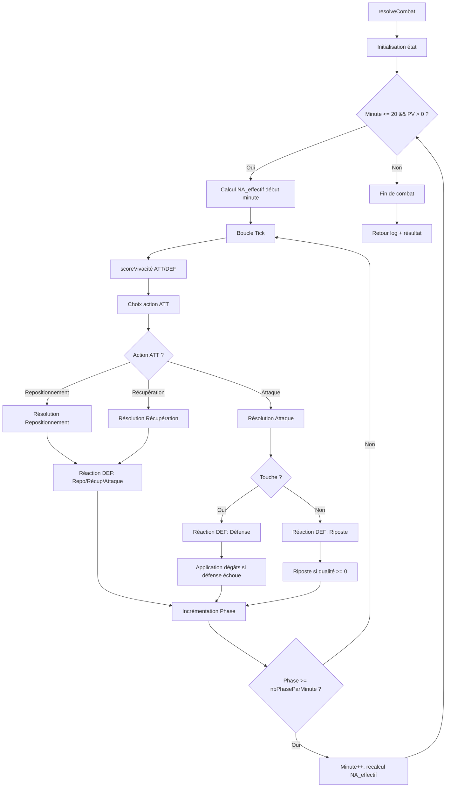

# Design Document — Combat Enrichi

## Vue d'ensemble (Overview)

Ce document décrit la conception technique du système de combat enrichi pour le Dungeon Crawler. Le système refactorise `server/game/combat.js` pour passer d'un modèle à 5 minutes fixes (1 action/minute) à une boucle tick-par-tick avec :

- **Endurance** : ressource consommée par chaque action, plafonnant le NA effectif.
- **Distance** : variable continue (1–10) influençant les scores d'attaque via la portée de l'arme.
- **Fatigue liée à la charge** : surcoût d'endurance quand le poids porté dépasse la capacité de portage.
- **Tactique (ex-stratégie)** : 5 minutes × 3 paramètres (EO/NA/EN) pilotant les choix d'action et les scores.

Le refactoring conserve les helpers existants (`line()`, `computeScores`, `computeDamage`, `computeArmorReduction`) en les adaptant aux nouvelles formules, et maintient la signature `resolveCombat(playerData, creatureData)` compatible avec `server/index.js`.

---

## Architecture

### Diagramme de flux principal



### Principes architecturaux

1. **Refactoring, pas réécriture** : les fonctions existantes sont adaptées, pas supprimées.
2. **Single Source of Truth** : toute la logique de combat reste dans `server/game/combat.js`.
3. **Compatibilité ascendante** : la signature `resolveCombat(playerData, creatureData, options?)` reste compatible.
4. **Déterminisme testable** : injection optionnelle d'un générateur de dés pour les tests.
5. **Logging conditionnel** : `DEV_MODE` contrôle les lignes `"debug"` sans impacter les performances en production.

---

## Composants et Interfaces

### Fonctions conservées et adaptées

| Fonction existante | Rôle après refactoring |
|---|---|
| `computeScores(stats)` | Calcule `BaseAttack`, `BaseDodge`, `BaseParry`, `BaseRiposte`, `enduranceInit` |
| `computeStrategyMods(eo, na, en)` | **Renommée** `computeTacticMods(eo, na_effectif, en)` — calcule les modificateurs tactiques pour les scores |
| `computeDamage(weaponDef, weaponItem, attackerStats, armorReduction)` | Adapté pour inclure `modAffinité` et `modTypeDégâts` |
| `computeArmorReduction(equipment)` | Conservé tel quel (retourne 0 car armures non implémentées) |
| `line(type, text)` | Conservé tel quel |
| `resolveCombatMinute(...)` | **Renommée** `resolveCombatTick(...)` — résout un tick unique |
| `resolveCombat(playerData, creatureData)` | Refactoré : boucle tick-par-tick avec gestion minutes/phases |

### Nouvelles fonctions internes

| Fonction | Rôle |
|---|---|
| `computeCharge(weaponDef, equipment)` | Calcule la Charge totale d'un combattant |
| `computePortage(stats)` | Calcule la capacité de portage |
| `computeSurcoutEndurance(charge, portage)` | Calcule le surcoût d'endurance lié à la surcharge |
| `computeVivacite(naEffectif, stats, momentum, d10)` | Calcule le scoreVivacité pour un tick |
| `chooseAction(eo, endurance, coutAttaque, coutRepo)` | Détermine l'action d'ATT avec dégradation |
| `chooseDefense(defenderStats, eo, naEffectif, en, endurance, coutEsquive, coutParade)` | Choisit la meilleure défense pour DEF |
| `resolveReposition(distanceReelle, distanceSouhaitee)` | Calcule la nouvelle distance |
| `resolveDefenderReaction(...)` | Gère la réaction de DEF quand ATT ne l'attaque pas |
| `validateInputs(playerData, creatureData)` | Valide les données d'entrée |

### Signature de `resolveCombat`

```javascript
export function resolveCombat(playerData, creatureData, options = {}) {
  // options.devMode : boolean (défaut: false) — active le log debug
  // options.rollDie : function(min, max) — injecteur de dés pour tests
}
```

### Interface d'entrée `playerData`

```javascript
{
  name: string,           // nom du joueur
  stats: {                // statistiques
    force, taille, constitution, intelligence, vitesse, adresse, volonté
  },
  hp: number,             // PV actuels (= hpMax en début de combat)
  tactic: [               // tableau de 5 éléments (ex-"strategy")
    { EO: 1-10, NA: 1-10, EN: 1-10 },  // minute 1
    { EO: 1-10, NA: 1-10, EN: 1-10 },  // minute 2
    { EO: 1-10, NA: 1-10, EN: 1-10 },  // minute 3
    { EO: 1-10, NA: 1-10, EN: 1-10 },  // minute 4
    { EO: 1-10, NA: 1-10, EN: 1-10 },  // minute 5+
  ],
  weaponDef: object,      // définition de l'arme (depuis weapons.json)
  weaponItem: object,     // instance de l'arme (tier, material, affinities)
  equipment: object|null  // armures (null = non implémenté)
}
```

### Interface d'entrée `creatureData`

```javascript
{
  nameFr: string,         // nom français de la créature
  stats: { force, taille, constitution, intelligence, vitesse, adresse, volonté },
  hp: number,
  tactic: {               // tactique par minute (format créature)
    min1: { EO, NA, EN },
    min2: { EO, NA, EN },
    min3: { EO, NA, EN },
    min4: { EO, NA, EN },
    min5: { EO, NA, EN }
  },
  weaponDef: object,
  equipment: object|null,
  family: string          // famille de la créature (pour affinité)
}
```

### Interface de sortie

```javascript
{
  log: Array<{ type: string, text: string }>,
  playerHpFinal: number,
  creatureHpFinal: number,
  winner: "player" | "creature" | "draw"
}
```

---

## Modèles de données

### État interne du combat (`CombatState`)

```javascript
{
  minute: number,              // 1–20+
  phase: number,               // 1–nbPhaseParMinute
  nbPhaseParMinute: 60,        // constante
  distanceReelle: number,      // 1–10 (init: 10)
  momentumA: 0,                // placeholder
  momentumB: 0,                // placeholder

  combatants: {
    player: {
      name: string,
      stats: object,
      hp: number,
      hpMax: number,
      endurance: number,
      enduranceInit: number,
      naEffectif: number,
      charge: number,
      portage: number,
      surcoutEndurance: number,
      weaponDef: object,
      weaponItem: object,
      armorReduction: number,
      tactic: array             // [min1, min2, min3, min4, min5]
    },
    creature: {
      // même structure
    }
  }
}
```

### Formules clés (résumé)

| Formule | Expression |
|---|---|
| EndInit | `Math.floor((constitution + volonté + 10) × 2)` |
| Charge | `Math.floor(PoidsArmeDroite + PoidsBouclier + Math.floor(PoidsArmures / 4))` |
| Portage | `Math.floor(force + Math.floor(taille / 2))` |
| Surcoût | `Math.floor(Math.max(0, Charge - Portage) × 10 / 26)` |
| CoûtNA | `Math.floor(NA_effectif / 2)` |
| NA_effectif | `Math.min(NA_tactique, Math.floor(Endurance / 2))` |
| scoreVivacité | `Math.floor(NA_effectif + vitesse × 0.6 + intelligence × 0.4 + d10 + momentum)` |
| BaseAttack | `Math.floor((adresse × 0.5 + vitesse × 0.3 + intelligence × 0.2) × 4)` |
| modEN | `Math.floor(abs(DistanceRéelle - WeaponEN) × 2)` |
| BaseDodge | `vitesse × 2 + adresse - taille` |
| BaseParry | `adresse + force + volonté` |
| BaseRiposte | `Math.floor((intelligence + adresse × 0.5 + vitesse × 0.5) / 2)` |
| TotalDamage | `Math.floor(baseArme × modMatériau × coefStats × modAffinité × modTypeDégâts)` |

### Table des matériaux

| Index | Multiplicateur |
|---|---|
| 0 | 1.000 |
| 1 | 1.250 |
| 2 | 1.375 |
| 3 | 1.500 |
| 4 | 1.625 |
| 5 | 1.750 |
| 6 | 1.875 |
| 7 | 2.000 |

### Coûts d'endurance par action

| Action | Coût |
|---|---|
| Attaque | `Math.floor(WeaponWeight + CoûtNA + Surcoût)` |
| Esquive | `Math.floor(5 + CoûtNA + Surcoût)` |
| Parade | `Math.floor(2 + CoûtNA + Surcoût)` |
| Repositionnement | `Math.floor(1 + CoûtNA + Surcoût)` |
| Récupération | `−1` (gain) |

---

## Correctness Properties

*A property is a characteristic or behavior that should hold true across all valid executions of a system — essentially, a formal statement about what the system should do. Properties serve as the bridge between human-readable specifications and machine-verifiable correctness guarantees.*

### Property 1: Combat initialization invariant

*For any* valid pair of `playerData` and `creatureData`, calling `resolveCombat` SHALL produce a combat state where: `Minute = 1`, `Phase = 1`, `nbPhaseParMinute = 60`, `DistanceRéelle = 10`, `Momentum = 0` for both combatants, `EndInit = Math.floor((constitution + volonté + 10) × 2)` for each combatant, and `hpMax` equals the `hp` provided in input.

**Validates: Requirements 1.1, 1.2, 1.3, 1.4, 1.5**

### Property 2: Invalid input rejection

*For any* `playerData` or `creatureData` that is null, undefined, or missing required fields (`stats`, `hp`, `tactic`), and *for any* `tactic` that is not an array of 5 elements each containing `EO`, `NA`, and `EN` keys, `resolveCombat` SHALL throw an `Error` with a message identifying the invalid parameter.

**Validates: Requirements 1.6, 1.7, 17.4, 17.7**

### Property 3: Load and encumbrance calculation

*For any* combatant with weapon weight `w`, shield/left-hand weight `s`, armor weight `a` (currently 0), force `f`, and taille `t`: `Charge = Math.floor(w + s + Math.floor(a / 4))`, `Portage = Math.floor(f + Math.floor(t / 2))`, and `Surcoût = Math.floor(Math.max(0, Charge - Portage) × 10 / 26)`. When `Charge <= Portage`, `Surcoût` SHALL be `0`.

**Validates: Requirements 2.1, 2.2, 2.3**

### Property 4: Action cost formulas

*For any* `NA_effectif` value and `Surcoût` value, the endurance costs SHALL be: `CoûtNA = Math.floor(NA_effectif / 2)`, Attack cost = `Math.floor(WeaponWeight + CoûtNA + Surcoût)`, Dodge cost = `Math.floor(5 + CoûtNA + Surcoût)`, Parry cost = `Math.floor(2 + CoûtNA + Surcoût)`, Reposition cost = `Math.floor(1 + CoûtNA + Surcoût)`, and Recovery SHALL add `1` to endurance (capped at `EndInit`).

**Validates: Requirements 3.1, 3.2, 3.3, 3.4, 3.5, 3.6**

### Property 5: Endurance invariant

*For any* sequence of combat actions, the endurance of each combatant SHALL remain within `[0, EndInit]` at all times. After every modification, `endurance = Math.max(0, Math.min(EndInit, endurance))`.

**Validates: Requirements 3.7**

### Property 6: NA_effectif calculation and stability

*For any* combatant at the start of a minute with `NA_tactique` and current `Endurance`, `NA_effectif = Math.min(NA_tactique, Math.floor(Endurance / 2))` (with `NA_effectif = 0` if `Endurance <= 0`). Once computed, `NA_effectif` SHALL NOT change during that minute regardless of endurance changes.

**Validates: Requirements 4.1, 4.2, 4.3**

### Property 7: Initiative determination

*For any* two combatants with stats, `NA_effectif`, and injected `d10` values, `scoreVivacité = Math.floor(NA_effectif + vitesse × 0.6 + intelligence × 0.4 + d10 + 0)`. The combatant with the higher `scoreVivacité` SHALL be designated ATT. On tie, the combatant with higher `NA_effectif` SHALL be ATT. On double tie, a 50/50 coin flip SHALL decide.

**Validates: Requirements 5.1, 5.2, 5.3, 5.4**

### Property 8: Action selection with degradation

*For any* ATT with `EO`, endurance, attack cost, and reposition cost: if `D10_EO <= EO` the intended action is Attack, otherwise Repositionnement. If endurance is insufficient for the intended action, it SHALL degrade following the chain Attack → Repositionnement → Récupération, stopping at the first affordable action. Endurance is checked *before* deduction.

**Validates: Requirements 6.1, 6.2, 6.3, 6.4, 6.5, 6.6**

### Property 9: Attack score and hit determination

*For any* attacker with stats and weapon at distance `d` from target with weapon range `WeaponEN`: `BaseAttack = Math.floor((adresse × 0.5 + vitesse × 0.3 + intelligence × 0.2) × 4)`, `modEN = Math.floor(|d - WeaponEN| × 2)`, `AttackScore = BaseAttack - modEN`, `AttackQuality = AttackScore - D100`. The attack hits if and only if `AttackQuality >= 0`.

**Validates: Requirements 7.1, 7.2, 7.3, 7.4, 7.5, 7.6**

### Property 10: Repositioning formula with clamping

*For any* current `DistanceRéelle` and `EN` value of ATT, after repositioning: `DistanceRéelle += Math.floor((11 - EN - DistanceRéelle) × 0.5)`, and the result SHALL be clamped to `[1, 10]`.

**Validates: Requirements 8.1, 8.3**

### Property 11: Defense selection and resolution

*For any* DEF with stats, tactical params (`EO`, `NA_effectif`, `EN`), and endurance: `BaseDodge = vitesse × 2 + adresse - taille`, `DodgeScore = BaseDodge + (5 - EO) + (NA_effectif - 5) + (5 - EN)`, `BaseParry = adresse + force + volonté`, `ParryScore = BaseParry + (5 - EO) + (5 - NA_effectif) + (EN - 5)`. The defense with the highest score SHALL be chosen (Parry wins ties). If the chosen defense is unaffordable, it SHALL fall back (Dodge → Parry → encaisse). A defense succeeds if `Score - D100 >= 0`; on success, no damage is applied; on failure, damage is applied.

**Validates: Requirements 10.1, 10.2, 10.3, 10.4, 10.5, 10.6, 10.7, 10.9, 10.11, 10.12, 10.13**

### Property 12: Riposte resolution

*For any* DEF when ATT has missed, `BaseRiposte = Math.floor((intelligence + adresse × 0.5 + vitesse × 0.5) / 2)`, `RiposteScore = BaseRiposte + (NA_effectif - 5) - DistanceRéelle`, `RiposteQuality = RiposteScore - D100`. If `RiposteQuality >= 0` and DEF has sufficient endurance for an attack, the riposte proceeds with `DistanceRiposte = Math.max(1, DistanceRéelle - 2)` and uses the standard attack formula at that distance. A successful riposte applies damage to ATT.

**Validates: Requirements 11.1, 11.2, 11.3, 11.4, 11.5, 11.7, 11.8, 11.9, 11.10, 11.11**

### Property 13: Defender reaction when ATT does not attack

*For any* tick where ATT repositions or recovers: a dedicated `D10_EO_DEF` roll determines DEF's intention. If `D10 <= EO_DEF` and endurance is sufficient, DEF attacks (with standard attack resolution and defense for ATT). If endurance is insufficient, DEF's action degrades. If `D10 > EO_DEF` and `DistanceRéelle != Distance_Souhaitée_DEF`, DEF attempts repositioning with `ScoreRepo = Math.floor((vitesse × 0.6 + intelligence × 0.4) × 5)`; success if `ScoreRepo - D100 >= 0`. If at desired distance or reposition fails, DEF recovers.

**Validates: Requirements 12.1, 12.2, 12.3, 12.4, 12.5, 12.6, 12.7**

### Property 14: Damage formula

*For any* successful hit with weapon definition (`damFirst`, `damLast`, `nbTiers`, `tier`, `material`, stat weights) and attacker stats: `baseArme = Math.floor(damFirst + (damLast - damFirst) × (tier - 1) / Math.max(nbTiers - 1, 1))`, `modMatériau` from the discrete table `[1.0, 1.25, 1.375, 1.5, 1.625, 1.75, 1.875, 2.0]`, `coefStats = 1 + Σ((stat - 12) × 0.02 × weight)`, `modAffinité = affinité / 100`, `TotalDamage = Math.floor(baseArme × modMatériau × coefStats × modAffinité × 1.0)`, `dégâtsFinaux = Math.max(0, TotalDamage - 0)`. HP after hit SHALL be `Math.max(0, Math.min(hpMax, hp - dégâtsFinaux))`.

**Validates: Requirements 13.1, 13.2, 13.3, 13.4, 13.6, 13.7, 13.9, 13.10**

### Property 15: Phase advancement and minute transitions

*For any* action, Phase SHALL increment by: `WeaponWeight` (attack), `2` (reposition or dodge), `1` (parry or recovery). When `Phase >= nbPhaseParMinute`, `Minute` SHALL increment, `Phase` SHALL reset to `1`, and `NA_effectif` SHALL be recalculated for each combatant.

**Validates: Requirements 7.7, 8.2, 9.2, 10.8, 10.10, 15.1**

### Property 16: Combat termination conditions

*For any* combat: (a) when a combatant's HP reaches 0, combat SHALL end immediately with no further ticks; (b) when `Minute > 20` at a minute transition, combat SHALL end as a draw. The return value SHALL always contain `{ log, playerHpFinal, creatureHpFinal, winner }` with `winner ∈ {"player", "creature", "draw"}`.

**Validates: Requirements 15.4, 15.5, 15.6, 15.7**

### Property 17: Log integrity

*For any* combat execution: (a) every log entry SHALL have the shape `{ type: string, text: string }`; (b) every `type` SHALL be one of the 23 valid types; (c) a `"separator"` entry SHALL appear at the start of each minute and before the final outcome line; (d) the final log entry SHALL be `"victory"`, `"defeat"`, or `"draw"` matching `winner`; (e) with `devMode = true`, at least one `"debug"` entry SHALL be present; (f) with `devMode = false`, no `"debug"` entries SHALL be present.

**Validates: Requirements 15.8, 15.9, 15.10, 16.1, 16.2, 16.5, 16.7, 16.8**

### Property 18: Tactic selection by minute

*For any* combat minute `m`: if `m <= 5`, the tactic parameters `EO/NA/EN` for that minute SHALL be read from index `m-1` of the tactic array (player) or key `min{m}` (creature). If `m > 5`, the parameters of minute 5 SHALL be used.

**Validates: Requirements 15.2, 15.3**

---

## Error Handling

### Input Validation Errors

| Condition | Error Message |
|---|---|
| `playerData` null/undefined/missing `stats`/`hp`/`tactic` | `"resolveCombat: playerData invalide"` |
| `creatureData` null/undefined/missing `stats`/`hp`/`tactic` | `"resolveCombat: creatureData invalide"` |
| `playerData.tactic` not array of 5 with EO/NA/EN | `"resolveCombat: tactic joueur invalide (attendu: tableau de 5 éléments {EO, NA, EN})"` |
| `creatureData.tactic` missing min1–min5 keys | `"resolveCombat: tactic créature invalide (attendu: min1..min5 avec {EO, NA, EN})"` |
| `weaponDef` missing `dist` field | `"resolveCombat: champ 'dist' manquant dans weaponDef"` |

### Runtime Invariant Enforcement

- **Endurance clamping**: After every modification, `Math.max(0, Math.min(EndInit, endurance))`. No error thrown — silently clamped.
- **HP clamping**: After every modification, `Math.max(0, Math.min(hpMax, hp))`. No error thrown — silently clamped.
- **Distance clamping**: After every repositioning, `Math.max(1, Math.min(10, distanceReelle))`. No error thrown — silently clamped.
- **Missing weapon weight**: If `weaponDef.weight` is undefined, default to `0` (Req 2.5).
- **Missing affinity data**: If `weaponItem.affinities` or the target family key is missing, default `modAffinité = 0` (no bonus damage).

### Graceful Degradation

- Action degradation chain (Attack → Reposition → Recovery) ensures combat never deadlocks due to insufficient endurance.
- Defense degradation (Dodge → Parry → Encaisse) ensures DEF always resolves even when exhausted.
- Recovery action always succeeds (cost = -1, always affordable) — acts as the ultimate fallback.

---

## Testing Strategy

### Property-Based Testing

The combat system is highly suitable for property-based testing because:
- It contains many **pure formulas** with clear input/output behavior
- There are **universal invariants** (endurance bounds, HP bounds, distance bounds)
- The **input space is large** (stats 3–21, EO/NA/EN 1–10, weapons with varying weights/ranges)
- **Determinism via dice injection** makes all outcomes reproducible

**Library**: [fast-check](https://github.com/dubzzz/fast-check) (JavaScript PBT library, well-maintained, supports ES modules)

**Configuration**:
- Minimum **100 iterations** per property test
- Dice injection via `options.rollDie` parameter for deterministic testing
- Each test tagged with: `Feature: combat-enrichi, Property {N}: {title}`

### Test Architecture

```
server/game/__tests__/
├── combat.property.test.js    # Property-based tests (Properties 1–18)
├── combat.unit.test.js        # Example-based unit tests
└── combat.integration.test.js # Integration with server/index.js
```

### Property Tests (fast-check)

Each of the 18 correctness properties maps to one property-based test. Key generators:

- **`arbStats()`**: Generates valid stat objects (force, taille, constitution, intelligence, vitesse, adresse, volonté) with values in [3, 21]
- **`arbTactic()`**: Generates valid tactic arrays (5 elements, EO/NA/EN in [1, 10])
- **`arbWeaponDef()`**: Generates weapon definitions with valid weight, dist, damFirst, damLast, models, stat weights
- **`arbWeaponItem()`**: Generates weapon instances with tier [1, 7], material [0, 7], affinities
- **`arbCombatState()`**: Generates mid-combat states for testing transitions
- **`arbDiceSequence()`**: Generates deterministic dice sequences for injection

### Unit Tests (example-based)

Focus on:
- Specific combat scenarios with known outcomes (e.g., one-hit kill, draw at minute 21)
- Edge cases: endurance exactly at cost threshold, distance at boundaries (1, 10)
- DEV_MODE log content verification
- Backward compatibility with existing `server/index.js` call pattern
- Armor placeholder behavior (always 0)
- Momentum placeholder behavior (always 0)

### Integration Tests

- Verify `resolveCombat` works with real `playerData`/`creatureData` structures from `server/index.js`
- Verify the `strategy` → `tactic` rename is handled in the socket handler
- Verify weapon data from `weapons.json` integrates correctly
- Verify `DEV_MODE` parameter passing from `server/index.js`

### Test Runner

- **Vitest** (already standard for Node.js ES module projects, or Jest with ESM support)
- Run with `vitest --run` for single execution (no watch mode in CI)

